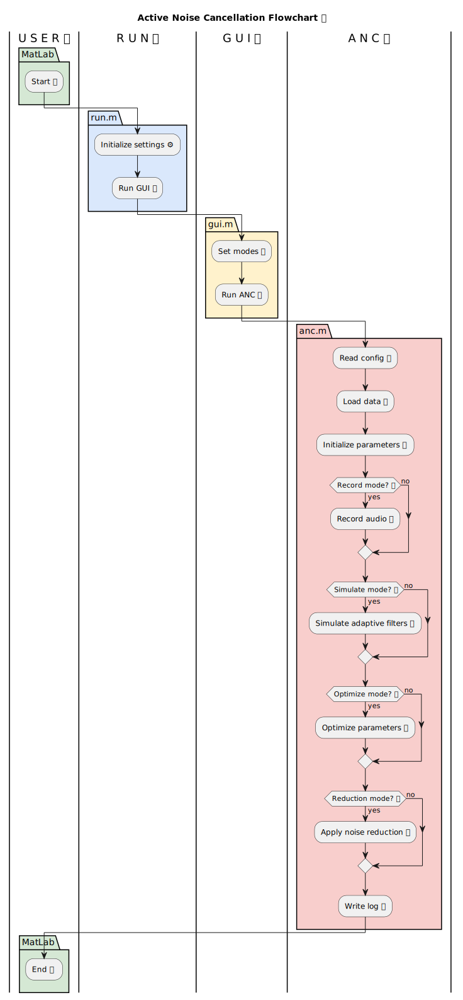

# 🔇 Active Noise Cancellation Using Filtered Adaptive Algorithms


**Active Noise Cancellation (ANC)** is an advanced signal processing technique used to suppress unwanted acoustic noise by generating an **anti-noise signal** that destructively interferes with the noise. Over the past decade, ANC has gained significant importance in applications such as **audio systems, headphones, hearing aids, and embedded DSP platforms**.

This repository presents a **complete MATLAB implementation** of an ANC system using both **classical adaptive algorithms** and **filtered adaptive algorithms**, with performance evaluation on **simulated** and **real audio signals**.

<p align="center">
  
</p>

---

## 📖 Table of Contents

- [Project Overview](#-project-overview)
- [Repository Structure](#-repository-structure)
- [Adaptive Noise Cancellation Principle](#-adaptive-noise-cancellation-principle)
- [Filtered Adaptive Algorithms](#-filtered-adaptive-algorithms)
- [Dataset Description](#-dataset-description)
- [Configuration Parameters](#-configuration-parameters)
- [Execution Instructions](#-execution-instructions)
- [System Flowchart](#-system-flowchart)
- [Installation](#-installation)
- [Conclusion](#-conclusion)

---

## 🔍 Project Overview

This project explores **Active Noise Cancellation (ANC)** through MATLAB-based simulation and experimentation.

### Implemented Algorithms

**1. Adaptive Algorithms**
- Least Mean Squares (**LMS**)
- Normalized Least Mean Squares (**NLMS**)
- Recursive Least Squares (**RLS**)

**2. Filtered Adaptive Algorithms**
- Filtered-x LMS (**FxLMS**)
- Filtered-x NLMS (**FxNLMS**)
- Filtered-x RLS (**FxRLS**)

### Performance Evaluation Criteria
- **Convergence characteristics:** Speed at which the filter adapts.
- **Steady-state error:** Precision of the cancellation after convergence.
- **Noise attenuation capability:** Overall decibel reduction.

Both **simulated noise signals** and **real recorded audio signals** are used for evaluation. A **Wiener Filter** is used as a baseline reference for optimal performance.

---

## 📂 Repository Structure

```text
├── config/                 # Configuration files
│   └── *.txt
├── data/                   # Input datasets
│   └── *.mat
├── images/                 # Figures and illustrations
│   └── *.png
├── logs/                   # Execution logs
│   └── *.txt
├── plots/                  # Generated plots
│   └── *.png
├── results/                # Numerical results
│   └── *.csv
├── src/                    # MATLAB source files
│   └── *.m
├── flowchart.wsd           # System flowchart (PlantUML)
├── run.m                   # Main execution script
├── .gitignore
└── README.md
```
## 🧠 Adaptive Noise Cancellation Principle

<p align="center">
  
</p>

An adaptive noise cancellation system uses a **reference noise signal** $x(n)$ to generate an **anti-noise signal** $y(n)$ through an adaptive filter. The objective is to minimize the error signal:

$$e(n) = d(n) - y(n)$$

Where:
- $d(n)$: Desired signal containing noise.
- $e(n)$: Residual error signal.

The adaptive filter coefficients are updated iteratively to minimize the **Mean Square Error (MSE)**.

**System Components:**
- $P(z)$: Primary path impulse response.
- $W(z)$: Adaptive filter.

---

## 🤖 Filtered Adaptive Algorithms

<p align="center">
  
</p>

In real ANC systems, the anti-noise signal passes through a **secondary path** (speaker, amplifier, acoustic path, microphone), represented by:

$$S(z)$$

Ignoring this path can cause **instability and divergence**.

### Filtered Adaptive Algorithm Strategy
1.  Estimate the secondary path as $\hat{S}(z)$.
2.  Filter the reference signal before adaptation.
3.  Update filter coefficients using the **filtered reference signal** $x'(n)$.

The secondary path is estimated **offline** using **white noise excitation** and the **LMS algorithm**.

---

## 📊 Dataset Description

| File Name | Description |
| :--- | :--- |
| `noise.mat` | Reference noise signal $x(n)$. |
| `speech.mat` | Speech signal added to the desired signal. |
| `bpir.mat` | Primary path impulse response $P(z)$. |
| `rec.mat` | Real recorded audio (user configurable). |

> ⚠️ **Note:** Noise and speech signals must be **uncorrelated** to avoid speech distortion during cancellation.

---

## ⚙️ Configuration Parameters

File paths and names can be modified in `config.txt`. Key parameters in `anc.m` include:

| Parameter | Description |
| :--- | :--- |
| `d` | Recording duration (seconds). |
| `p` | Boolean flag to play recorded audio. |
| `T` | Number of iterations for the loop. |
| `N` | Number of experiments to average. |
| `L` | Adaptive filter length (taps). |
| `L_vec` | Vector containing different filter lengths for comparison. |
| `mu_vec` | Step-size vector (learning rate). |
| `alg` | Algorithm selection identifier. |
| `play` | Audio playback control. |
| `src` | Speech source selection switch. |

---

## 🏃 Execution Instructions

### 1. Installation
Ensure you have MATLAB (**R2020a** or later recommended) installed.

Clone the repository:
```bash
git clone [https://github.com/yourusername/anc-filtered-algorithms.git](https://github.com/yourusername/anc-filtered-algorithms.git)
cd anc-filtered-algorithms
```
### 2. Running the Simulation

Navigate to the project directory in MATLAB and execute the main script:

```matlab
run.m
```
This script performs the following pipeline:
* **Dataset loading:** Imports `.mat` files from the `data` folder.
* **Algorithm execution:** Runs the selected adaptive filter (LMS, RLS, FxLMS, etc.).
* **Performance evaluation:** Calculates MSE and attenuation.
* **Plot generation:** Saves visual results to the `/plots` directory.

---

## 🔁 System Flowchart

<p align="center">
  
</p>

---

## 💡 Conclusion

The performance of an ANC system depends heavily on algorithm choice and parameter tuning.

* **Classical adaptive algorithms** (LMS/RLS) provide faster convergence in ideal setups.
* **Filtered adaptive algorithms** (FxLMS/FxRLS) ensure **stability** and lower steady-state error in real-world conditions where the secondary path $S(z)$ is significant.

This project demonstrates:
* Practical ANC system modeling.
* Trade-offs between convergence speed and noise suppression.
* Realistic DSP implementation considerations.

> 📌 **This repository serves as a strong foundation for further research in audio signal processing, hearing aid technologies, and embedded DSP-based ANC systems.**

---

## 📜 License

This project is licensed under the **MIT License**. See the [LICENSE](LICENSE) file for details.

You are free to:
* **Share** — copy and redistribute the material in any medium or format.
* **Adapt** — remix, transform, and build upon the material for any purpose, even commercially.
